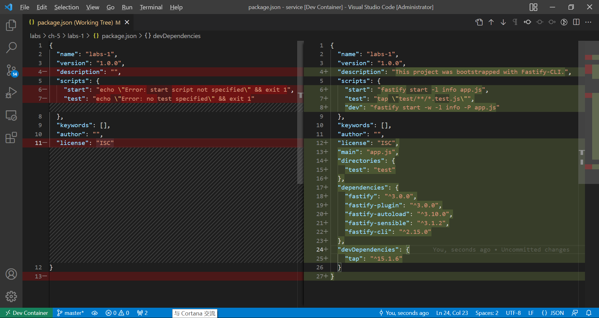

# Cheatsheet for fastify framework

## Setup

1. Initialize project folder  
`npm init fastify`

2. Install dependencies
`npm install`

## Project Structure

- **Entry point**  
  ***app.js***: exports an ***async*** function

## Plugin  

```javascript
function(fastifyInstance, opts, next){
    // invoke next() or return a promise 
}
```

- **Register a Plugin**

   ```javascript
   fastify.register(pluginFunction, options)
   ```

- **Notes**  
  1. Everything is a plugin in Fastify.  
     Entry point is a plugin. Routes are plugins. Plugins are also plugins.  
     Files in `plugins` folder are commonly de-encapsulated plugins, which are accessed by sibling plugins.  

  2. Plugins are called only at initialization time.

  3. Plugins are always asynchronous.

  4. Root plugin is the exported async function of app.js

## Fastify CLI

- **Run server**

    ```console

    fastify start app.js
    ```

- **Fastify CLI flags**

  - `-p`  
    Specify port. Default port is 3000

  - `-P`  
    Prettify log output

  - `-w`  
    Watch file and reload the project

## [create-fastify](https://github.com/fastify/create-fastify)

### Options

- `--integrate`  

  将 Fastify 集成到现有的项目中去  

  `npm init fastify --integrate`  

  **注意**  

  集成模式会覆盖现有项目中的以下文件：

  - .gitignore
  - app.js
  - plugins
  - routes
  - test

  集成模式会修改现有项目中的以下文件：  

  - package.json

  The following picture demonstrates details about how fastify integrate mode modifies an existing package.json file.

  

## Fastify Instance

### Methods

#### Register route

- fastify.get('/', asyncRouteHandler)
- fastify.post('/', asyncRouteHandler)
- fastify.put('/', asyncRouteHandler)
- fastify.delete('/', asyncRouteHandler)

##### Route Handler

Notes:

1. **Not to forget `return` clause in the handler**

```javascript
async function(request, reply){
    // Whatever returned by this handler will be sent as the content of the HTTP response.
    // Alternatively, reply.send(content) can also used to do the same job. 

    // If return a string, it would be better to append '\n' to the end of the string in case
    // the server being accessed by command line tool to present a nice response which is
    // easily readable by human.

    // Stream can also be returned by this handler.
    // The behavior would be the same as passing a stream to `reply.send()`.
    // Fastify will pipe the stream returned or passed to the HTTP response.
}
```

###### `request` instance

- `request.method`  
  Possible values:
  - 'GET'

- `request.query`
  The queries of URL.  
  For example: `greeting` in `/hello?greeting=Ahoy`

###### `reply` instance

- `reply.type('text/html')`  
  Set Content-Type header
- `reply.status(405)`  
  Set HTTP status code
- `reply.send(anything even a stream)`
  Send response to a request. If an Error object is passed to it, it will automatically generate a *500 Server Error* status code.

Learn more about [request](https://www.fastify.io/docs/v3.27.x/Reference/Request/) and [reply](https://www.fastify.io/docs/v3.27.x/Reference/Reply/).

### Handlers

- `fastify.setNotFoundHandler(ROUTER_HANDLER)`  
  Define what to do if NO pathes or HTTP verbs matched

## Route

### Notes

1. `/` also being passed to registration methods for non-root routes thanks to `fastify-autoload` plugin. It will register the route prefixed with the name of subfolder.

2. *How to use callback-based api in an `async` route handler?*

   1. Add `await reply` at the end of the handler.
   2. `promisfy` the callback-based API.

3. What kinds of callback-based API can be `promisfy`ed?

   The ones invoking callbacks in an error-first result-last argument style.

  ```javascript
  function thisIsACallbackBasedApi (myArgumentsAreNoneOfYourBusiness, theCallback) {
    doingMyOwnBusiness();
    theCallback(error, result)
  }
  ```

## 3rd parties

### Plugins

- [fastify-static](https://github.com/fastify/fastify-static)  
  Serve static content. Due to it is not recommended to serve static content from Node process, we usually install it as a dev dependency.

  Options:
  - root  
    Serve all files under this directory.

  Decorations:
  - reply
  
    - sendFile()  
      Used to manually respond with the contents of a file for a route.  
      Example:  
      `reply.sendFile('hello.html')`
      This example will find `hello.html` from `root` option set when `fastify.register()` fastify-static plugin(e.g, if `root` option is set to `public`, `sendFile('hello.html')` will send the contents of `public\hello.html`).

  Notes:  
  1. There is no need to append spcific filename - `index.html` to the host URL.Take `http://localhost/` as an example, if you navigate to this URL and no root route defined in the fastify instance, then browser will automatically load index.html. On the other hand, if root route is available, then you'll need to navigate to `http://localhost/index.html` in order to load `index.html` instead.

- [point-of-view](https://github.com/fastify/point-of-view)
  Fastify's view rendering plugin.

  Supported template engine:  

  - [handlebars](https://handlebarsjs.com/)  
    Notes:  
    - Raw interpolation syntax: `{{{ body }}}`. HTML syntax will not be escaped.

    - Escaped interpolation syntax: `{{ body }}`. `<` in HTML code will be escaped to `&lt;`

  Options:  
  - engine  
    The value should be an object. The keys of this object should be the name of the engine and value should be the engine library.
    For example: `engine: { handlebars }`  

  - root  
    The path where to find views.

  - layout  
    With this option being set, plugin `point-of-view` will automatically create a template local - `body`

  Decorations:

  - reply

    - view(`template file name`, `object store of template locals`)  
    Invoke template engine to render specific views and send the result as respone.  
    For example: `return reply.view('index.hbs')` searches `index.hbs` template in `root` option and render it then send the result.

- [fastify-sensible](https://github.com/fastify/fastify-sensible)  
  
  Defaults for Fastify which people need.  

  **Usage:**

  ```javascript
  fastify.register(require('fastify-sensible'))
  ```

  If you initialize the project with `create-fastify`, you won't need to run the lines above because it is registered already in `plugins/senseble.js`

  **APIs** are listed [here](https://github.com/fastify/fastify-sensible#api)

  **Decorations**  

  - `reply`  

    - `notFound()`

      1. Set response status code to 404.
      2. Generate JSON output describing `Not Found` error.
